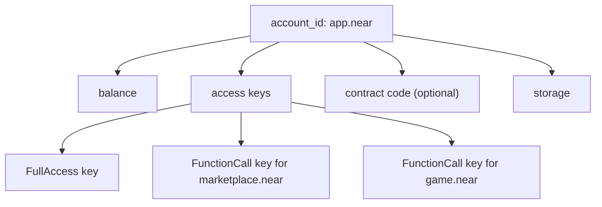
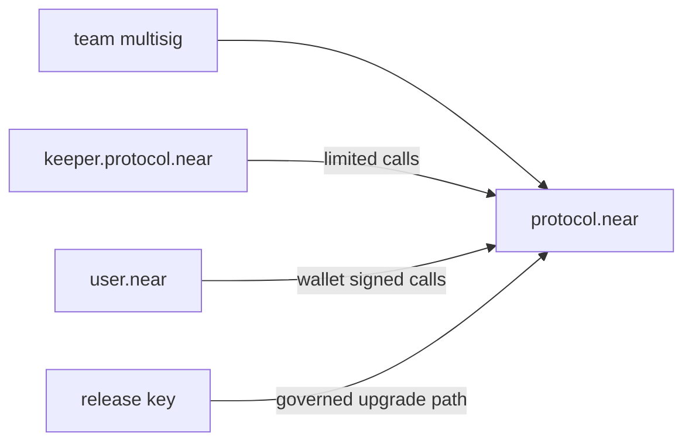

# NEAR Account Model Deep Dive: Named Accounts, Access Keys, Permissions, And Security

Assignment: `716ebe80-7083-4586-bfa0-7de890428ee3`

Job: `a6d0a7ea-cc72-42dd-aa22-2061f57e78a8`

Sources used:

- NEAR Docs, Account Model: https://docs.near.org/protocol/accounts-contracts/account-model
- NEAR Docs, Access Keys: https://docs.near.org/protocol/accounts-contracts/access-keys
- NEAR Docs, RPC Access Keys: https://docs.near.org/api/rpc/access-keys
- NEAR Docs, API Libraries: https://docs.near.org/tools/near-api

## Overview

NEAR accounts are more expressive than a single public-key address. A NEAR account is an on-chain object identified by an account ID, controlled by one or more access keys, and optionally holding deployed smart-contract code. This model makes human-readable accounts, key rotation, app-specific permissions, and account-based onboarding first-class protocol concepts.

The key ideas:

- An account ID can be named, implicit, or Ethereum-like.
- An account can hold multiple access keys.
- Access keys can be full-access or function-call limited.
- A smart contract is deployed to an account, not to a separate anonymous address.
- Accounts can create subaccounts and manage permissions.
- Applications can use restricted keys so users do not expose full account control.

That combination changes how developers should design login, permissions, automation, custody, and smart-contract security.

## Account IDs

NEAR supports several account forms.

### Named Accounts

Named accounts are readable IDs such as:

```text
alice.near
marketplace.near
docs.example.near
worker.project.near
```

They are easy to share and can represent people, apps, organizations, or contracts. A named account is useful when discoverability matters. If a contract is deployed at `registry.near`, users can reason about that name more easily than about a long hex address.

Named accounts also support hierarchy through subaccounts. For example, `worker.project.near` is under `project.near`. This lets a project organize contracts, automation, and operational identities by namespace.

### Implicit Accounts

Implicit accounts are derived from a public key and look like long hex identifiers. They are useful for wallet flows, generated accounts, and lower-friction account creation. An implicit account already has a full-access key by construction, because its account ID is tied to the key material.

Implicit accounts are less readable, but they can be created without first coordinating a human-readable name.

### Ethereum-Like Accounts

NEAR also supports Ethereum-like account compatibility paths. These are useful for wallet and chain-abstraction flows where users arrive from EVM tooling. Developers should still understand the NEAR account object underneath: permissions and contract deployment follow NEAR's account model.

## Account Object

A NEAR account can contain:

- A balance.
- Access keys.
- Optional contract code.
- Storage usage.

Conceptual diagram:



This means account management is not just wallet management. The account is a programmable identity and authorization container.

## Full-Access Keys

A full-access key can do anything the account can do:

- Transfer NEAR.
- Add or delete keys.
- Deploy or replace contract code.
- Call any contract.
- Create subaccounts where permitted.
- Delete the account.

Treat full-access keys like root credentials. They should be stored carefully and never shared with third-party apps, public repositories, CI logs, or agent prompts. If an AI agent needs to operate an account, do not give it a full-access key unless the entire task explicitly requires full custody and the risk is acceptable.

Operational best practices:

- Keep at least one recovery full-access key under human/operator control.
- Rotate a full-access key if it may have leaked.
- Use separate operational accounts for automation.
- Prefer function-call keys for apps and agents.
- Do not put full-access private keys in plaintext project files.

## Function-Call Keys

A function-call key is a restricted key. It can call only a specific receiver contract, optionally only specific methods, and optionally only up to a gas allowance. It cannot attach NEAR tokens to calls.

The important fields are:

- `receiver_id`: the contract this key may call.
- `method_names`: optional list of allowed methods.
- `allowance`: optional gas allowance.

Example intent:

```json
{
  "receiver_id": "marketplace.near",
  "method_names": ["submit_work", "read_assignment"],
  "allowance": "250000000000000000000000"
}
```

That key is safer to give to a frontend, app, or automation agent than a full-access key. If leaked, it cannot transfer funds or deploy arbitrary code. It can only spend its allowance on permitted function calls.

Function-call keys are a major reason NEAR is friendly to delegated app experiences. An app can ask for limited permissions instead of asking for total account control.

## Named Account Creation

Creating a named account usually involves an existing account or registrar creating the new account and adding an initial full-access key. For top-level names, wallet or registrar flows handle availability and creation. For subaccounts, the parent account can create a child account such as:

```text
bot.project.near
```

Common subaccount uses:

- Separate contracts by module.
- Separate production, staging, and test deployments.
- Isolate automation agents.
- Create operational identities with limited permissions.

For example:

```text
project.near
  api.project.near
  escrow.project.near
  worker.project.near
  docs.project.near
```

This structure gives each deployed contract or worker identity a clear account boundary.

## Smart Contracts Live On Accounts

On NEAR, a contract is deployed to an account. That account becomes the contract address. The account may also still have keys, depending on how it is managed.

This has security consequences:

- A full-access key on a contract account can replace the contract.
- A locked contract account with no full-access keys is harder to mutate.
- Upgradeable contracts need explicit governance around who controls upgrade keys.
- Operational keys should not be able to deploy code unless that is intentional.

For production contracts, decide early whether the account should remain upgradeable, be controlled by multisig/governance, or be locked.

## Storage And Account Economics

NEAR accounts also pay for the storage they use. This matters because an account is not only a keyring; it is also where contract code and contract state live. When a contract stores user records, maps, metadata, or large serialized structures, that storage has an economic footprint. Developers should make storage costs explicit in onboarding and method design.

Practical implications:

- Account creation needs enough balance to cover initial storage.
- Deploying a contract increases storage usage because Wasm code is stored under the account.
- Contract state grows as users register, deposit, list items, or create records.
- Apps should charge, reserve, or refund storage where appropriate.
- Deleting state can free storage, but the contract must implement cleanup logic.

For example, a marketplace might require a storage deposit before a seller creates many listings. Without this, one user could force the contract account to subsidize everyone else's state. A well-designed contract makes the cost of persistent storage visible and reversible:

```text
seller registers
  -> attach storage deposit
  -> contract records seller profile
  -> unused deposit can be refunded

seller deletes profile
  -> contract removes records
  -> contract refunds releasable storage
```

This is also why function-call keys cannot attach NEAR. If a method requires storage deposit, the user must sign a transaction that attaches funds through a wallet or another authorized full-access flow. Do not design an app assuming a restricted key can pay storage on the user's behalf.

## Contract Deployment And Upgrade Authority

Because contracts live on accounts, upgrade authority is account authority. If a production contract account has an unmanaged full-access key, whoever controls that key can replace the contract code. That may be useful during early development, but it is risky once users rely on the contract.

There are several common deployment models:

| Model | How it works | Risk profile |
| --- | --- | --- |
| Developer full-access key | One operator can deploy upgrades directly | Fast but high trust |
| Team multisig | Multiple signers approve upgrade actions | Slower, safer for teams |
| DAO/governance account | Token holders or council approve upgrades | Transparent but operationally heavier |
| Locked account | Full-access keys removed after deployment | Hard to tamper with, but hard or impossible to upgrade |

The right model depends on the application. A tutorial contract may keep a developer key. A production escrow or marketplace should use multisig or governance. A stable immutable primitive may be locked.

Upgrade policy should be documented before users deposit meaningful assets. A useful public note answers:

- Who can upgrade the contract?
- How many approvals are needed?
- Is there a timelock?
- Can users exit before an upgrade?
- Where are upgrade transactions announced?

The account model gives developers flexibility, but it does not automatically make upgrade governance safe. The team must design the control path.

## Access Key Lifecycle

Keys should have a lifecycle, not just a creation moment.

### Add

Add a key only when there is a clear purpose. For a full-access key, record who owns it and why it exists. For a function-call key, record receiver, methods, and allowance.

### Use

Monitor whether the key is being used as expected. A key created for a frontend should not call unrelated methods. A key created for automation should not stay idle forever with a large allowance.

### Rotate

Rotate keys when operators change, devices are replaced, logs may have leaked, or automation is redeployed. A rotation process should add the new key, verify it works, then remove the old key.

### Revoke

Remove keys that are no longer needed. This is especially important for temporary agent tasks, hackathon demos, vendor integrations, and old CI jobs.

### Audit

Periodically query account keys and compare them against the expected key inventory. The audit should flag unexpected full-access keys, function-call keys with broad method access, old keys that have not been used recently, keys with large remaining allowance, and contract accounts that still have direct developer keys after launch.

This lifecycle thinking is simple, but it prevents the most common operational failures.

## Permissions Design For Applications

When designing a NEAR app, start by listing what the app truly needs:

| Need | Suggested permission |
| --- | --- |
| Read public state | No key needed |
| Call one app contract with no deposit | Function-call key |
| Call several app methods | Function-call key with method list |
| Transfer funds | User signs with full wallet flow, not shared app key |
| Deploy or upgrade contract | Full-access key held by operator/governance |
| Run agent automation | Dedicated account or limited function-call key |

This permission design prevents the most common mistake: giving an app or agent more authority than the task requires.

## App-Specific Permissions In Practice

Consider a marketplace where a user can create listings, accept orders, and withdraw earnings. A naive app might ask for a full-access key because that makes every action easy. A safer design separates permissions:

- Public browsing uses no key.
- Creating a listing uses a function-call key for `create_listing`.
- Accepting an order uses a function-call key for `accept_order`.
- Withdrawing earnings requires a wallet-signed transaction because funds move.
- Admin moderation uses a separate operator or governance account.

That design lets the app feel smooth while keeping high-risk operations under explicit wallet control.

For an AI agent, this matters even more. Agents are good at executing workflows, but they should not be given unnecessary custody. Give an agent the smallest key that lets it perform the job:

```text
good:
  agent key -> call submit_deliverable on marketplace.near

bad:
  agent key -> full access to operator.near
```

If the agent needs to submit work, it does not need permission to transfer all funds. If it needs to query assignments, it may not need any key at all.

## Recovery And Failure Modes

Account security should include recovery planning. The biggest risk is not only theft; it is also losing the only key.

Examples:

- A contract account is deployed with one laptop key, and the laptop is lost.
- A user deletes the only full-access key after adding a misconfigured function-call key.
- A CI secret expires, and no one knows which account it controlled.
- A frontend stores a key too broadly and must revoke it quickly.

Good recovery design includes a human-controlled recovery path for operational accounts, multisig for production upgrade authority, clear documentation of which keys are safe to delete, separate staging and production accounts, and small test transactions before rotating important keys.

For contract accounts that are intentionally locked, recovery is different. The point of locking is that no one can upgrade directly. Before locking, verify the contract has the intended governance or no-upgrade policy, because accidental locking can permanently freeze bugs.

## Comparing NEAR To Address-Only Chains

On many chains, a developer thinks primarily in terms of addresses and private keys. NEAR asks the developer to think in terms of accounts and permissions.

The shift looks like this:

| Address-only mental model | NEAR account model |
| --- | --- |
| Address is mostly a key-derived identifier | Account is a named object with keys, balance, storage, and optional code |
| One key often controls one address | Multiple keys can control one account |
| App permissions often rely on signatures per transaction | Apps can receive restricted function-call keys |
| Contract address is separate deployment output | Contract is deployed to an account ID |
| Human readability is external | Human-readable account IDs are native |

This gives NEAR developers more tools, but also more design choices. The best applications make those choices deliberately.

## Multi-Sig And Governance Patterns

For teams, a single full-access key is usually too risky. A better pattern is:

- Contract account controlled by a multisig or governance account.
- Deployment key used only for releases.
- Function-call keys for routine operations.
- Separate accounts for bots and agents.
- Logs and monitoring around key changes.

Example:



The goal is to make privileged actions rare, reviewable, and recoverable.

## Account Creation Flows

A developer may encounter several account creation flows:

1. Wallet creates a named account for a user.
2. A parent account creates a subaccount.
3. An implicit account is generated from a key.
4. An onboarding service sponsors initial account creation.
5. A contract creates accounts as part of a registration flow.

Each flow should answer:

- Who pays storage and creation costs?
- Which key is added first?
- Can the user recover the account?
- Is any app key added, and what can it call?
- Can the account deploy code?

For agent workflows, prefer a dedicated account or a function-call key scoped to a specific contract. Do not reuse a user's primary full-access key.

## Security Best Practices

### Never Share Full-Access Keys With Apps

Full-access keys are equivalent to account ownership. A compromised full-access key can transfer assets, delete keys, or replace contract code.

### Use Least Privilege

If an app only needs `submit_work`, give it a function-call key that can call only `submit_work` on the marketplace contract.

### Separate Human And Automation Accounts

Automation should run from a dedicated account such as:

```text
agent.project.near
```

This makes it easier to rotate keys, audit actions, and limit blast radius.

### Lock Or Govern Contract Accounts

If a contract should not be upgraded directly, remove unmanaged full-access keys or put upgrade authority behind multisig/governance.

### Monitor Key Changes

Adding a full-access key is a high-risk event. Removing a key can break automation. Monitor key changes as operational security events.

### Treat Function-Call Allowance As Spendable Gas

Function-call keys cannot transfer NEAR, but they can consume allowance on gas. Give them enough allowance to work, not unlimited allowance by default.

## Developer Examples

### Checking Access Keys Through RPC

RPC access-key queries can show whether a key is full-access or function-call limited. A function-call key reveals receiver, method names, and allowance.

Example using a provider:

```js
import { JsonRpcProvider } from "near-api-js/lib/providers";

const provider = new JsonRpcProvider({ url: "https://rpc.mainnet.near.org" });

const keys = await provider.query({
  request_type: "view_access_key_list",
  finality: "final",
  account_id: "example.near"
});

for (const key of keys.keys) {
  console.log(key.public_key, key.access_key.permission);
}
```

### Permission Review Checklist

Before adding a key:

- What contract does it need to call?
- Which methods does it need?
- Does it need to attach deposit? If yes, a function-call key is not enough.
- What gas allowance is reasonable?
- Who can revoke it?
- How will it be rotated?

Before deploying a contract:

- Which account will hold the contract?
- Which keys remain after deployment?
- Who can upgrade it?
- Is governance or multisig required?
- Are bot keys separate from admin keys?
- What storage costs will users create?
- Can users recover or revoke app permissions?
- Are temporary deployment keys removed after launch?

## Testing Account And Permission Assumptions

Do not rely on visual wallet flows alone. Add tests for permission boundaries:

- A function-call key can call the intended method.
- The same key cannot call an unrelated method.
- The key cannot attach deposit when the method requires funds.
- A revoked key no longer works.
- The contract account cannot be upgraded by an unexpected key.
- Storage deposit logic records and refunds the expected amount.

Testing these boundaries catches accidental broad permissions before production. It also helps teams document what each account and key is supposed to do.

## Common Pitfalls

- Giving a frontend a full-access key.
- Leaving a full-access key on a production contract account without governance.
- Using one account for user funds, automation, and contract deployment.
- Forgetting that function-call keys cannot attach NEAR.
- Giving a function-call key unlimited method access when only one method is needed.
- Failing to rotate keys after exposing them in logs or CI.
- Assuming named accounts and implicit accounts have the same creation and recovery flow.
- Treating contract account upgrades as routine calls instead of privileged governance actions.

## Practical Design Pattern

For a marketplace worker agent:

```text
operator.near
  - human-controlled account
  - holds recovery full-access key

worker.operator.near
  - dedicated agent account
  - no user funds
  - limited keys for marketplace calls

deliverables.operator.near
  - optional contract/account for published artifacts
```

This pattern separates operator custody, worker automation, and public deliverables.

For an app:

```text
app.near
  - contract account
  - upgrade controlled by multisig

user.near
  - user account
  - grants function-call key to app.near for app methods

keeper.app.near
  - automation account
  - scoped key for maintenance methods only
```

## Summary

NEAR's account model is built around accounts as programmable identities. Named accounts improve usability. Implicit accounts simplify key-derived onboarding. Multiple keys let developers apply least privilege. Function-call keys make app-specific permissions possible without exposing full custody. Smart contracts live on accounts, so contract upgrade security is account security.

The safest NEAR systems use clear account boundaries, function-call keys for routine app access, full-access keys only for custody or governance, and separate automation accounts for agents and bots. Treat key management as part of the application architecture, not as an afterthought.
